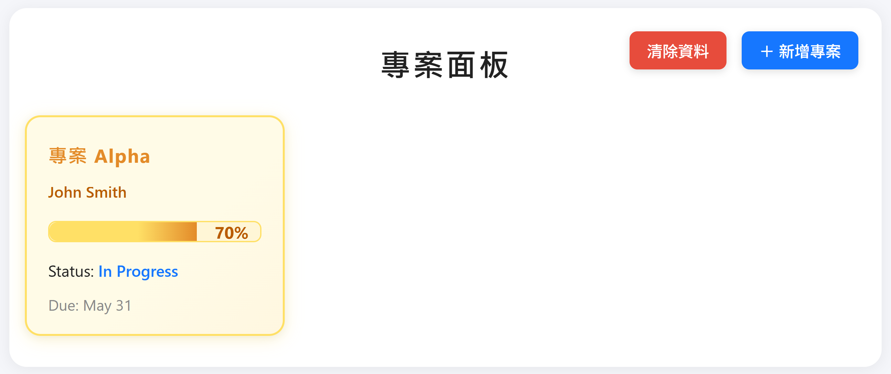
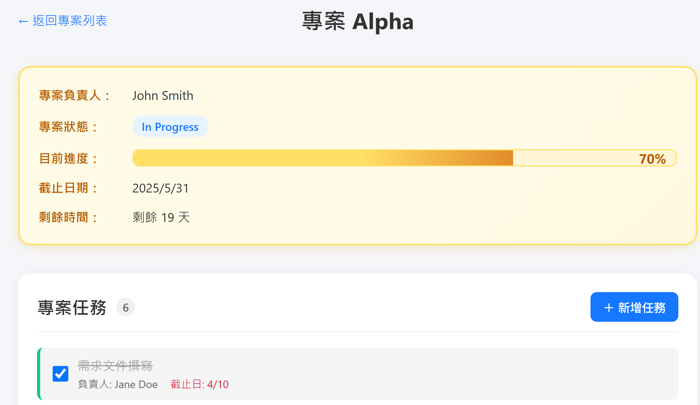
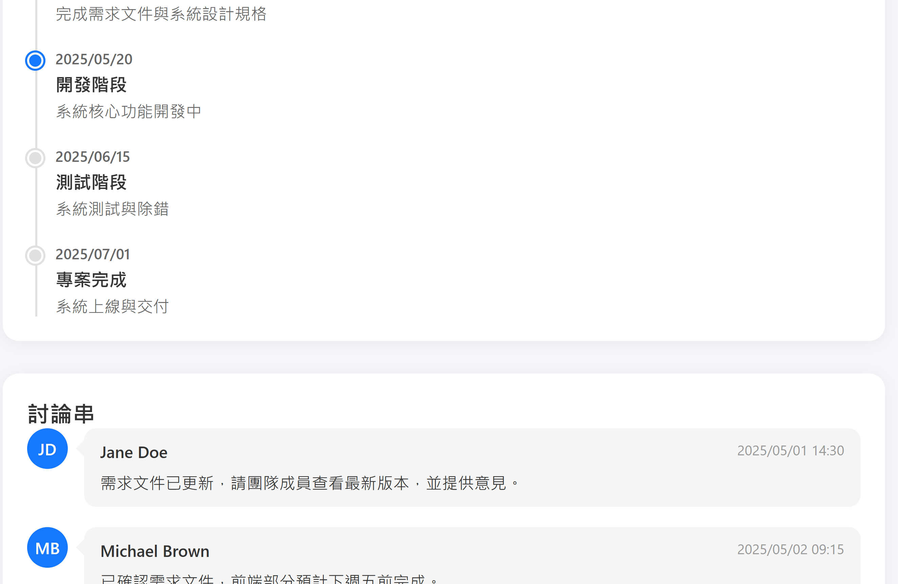

# 專案管理儀表板 (EIP Project Dashboard)

一個簡潔、直觀的專案管理儀表板，用於追蹤和管理多個專案的進度、任務和時程。專案使用純 HTML、CSS 和 JavaScript 開發，無需任何外部框架或庫。

## 專案預覽

### 專案儀表板


### 專案詳細頁面


### 專案詳細頁面2


## 功能特色

### 專案面板
- 顯示所有專案的卡片式概覽
- 每個專案卡片包含：名稱、負責人、進度條、狀態和截止日期
- 響應式設計，適應不同螢幕尺寸
- 點擊卡片可查看專案詳細資訊

### 專案詳細頁面
- 顯示專案的完整資訊
- 專案任務管理（新增、標記完成/未完成）
- 專案時程表視覺化
- 討論區功能，支援新增留言

### 資料管理
- 使用 localStorage 儲存專案和任務資料
- 支援新增專案和任務
- 清除資料功能

## 技術實現

- **前端**：純 HTML5、CSS3 和 JavaScript (ES6+)
- **資料儲存**：使用瀏覽器的 localStorage API
- **設計風格**：現代化、簡潔的 UI 設計，強調使用者體驗
- **響應式設計**：使用 CSS Grid 和 Flexbox 實現全響應式佈局

## 使用指南

### 專案面板
1. 點擊「＋新增專案」按鈕可新增專案
2. 填寫專案名稱、負責人和截止日期
3. 點擊「Create」按鈕建立新專案
4. 點擊任何專案卡片可查看該專案的詳細資訊
5. 點擊「清除資料」按鈕可重置所有專案資料

### 專案詳細頁面
1. 查看專案基本資訊、任務列表、時程和討論串
2. 點擊「＋新增任務」按鈕可新增任務
3. 勾選/取消勾選任務可標記其為完成/未完成
4. 在討論區輸入留言並點擊「發送」按鈕可新增留言
5. 點擊「返回專案列表」可回到專案面板

## 安裝與運行

1. 克隆此專案到本地：
   ```
   git clone https://github.com/ungetLai/eip-project-dashboard.git
   ```

2. 使用任何 Web 伺服器運行專案，例如：
   - 使用 Visual Studio Code 的 Live Server 擴充功能
   - 使用 Python 的簡易 HTTP 伺服器：
     ```
     # Python 3
     python -m http.server
     ```
   - 使用 Node.js 的 http-server：
     ```
     npx http-server
     ```

3. 在瀏覽器中訪問對應的 URL（通常是 http://localhost:8080 或類似網址）

## 未來規劃

- 實現後端 API 整合，替代 localStorage
- 添加用戶認證功能
- 實現專案和任務的編輯和刪除功能
- 添加專案分類和標籤功能
- 實現專案搜索和過濾功能
- 添加資料匯出功能

## 授權

[MIT License](LICENSE)

## 作者

[ungetLai](https://github.com/ungetLai)
